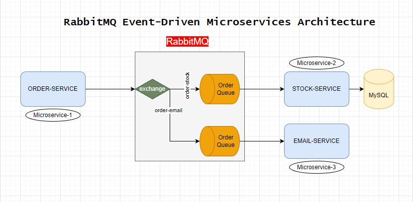

### RABBITMQ-MICROSERVİCES
Setup Docker Image

    1)  C:\Users\mdths>docker pull rabbitmq:3.11.13-management
    2)  C:\Users\mdths>docker run --rm -it -p 15672:15672 -p 5672:5672 rabbitmq:3.11.13-management

***
    http://localhost:15672/

* Username: *guest*
* Password: *guest*
* ****

